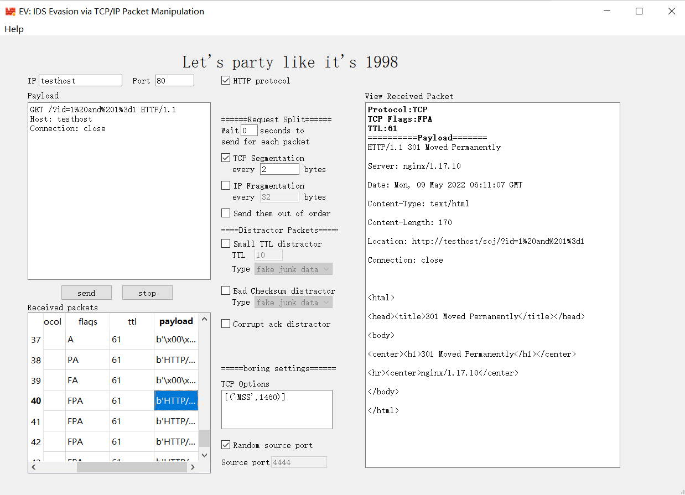

# EV: IDS Evasion via TCP/IP Packet Manipulation




[中文文档](#cndocs)
## Introduction

EV is a tool that allows you crafting TCP packets and leveraging some well-known TCP/IP packet manipulation techniques to evade IDS devices.

It supports HTTP protocol but unfortunately not HTTPS protocol. The handshake process of TLS is quite complecated and I haven't figure out how to craft TLS packets elegantly.

This tools is written in Python and QT5, using [Scapy](https://scapy.net/) to make packets. So though this software is tested on Windows platform only, it theoretically works on other platforms like Linux or MacOS. 

## Setup&run

Run following commands in your cmd/terminal to pull the latest version of the software and install required python packages:
```
git clone https://github.com/TomAPU/ev.git
cd ev
pip3 install -r requirements.txt
```
Run this command to start the software:
```
python3 ev.py
```
or you can click run.bat in the root directory of the software to start it.

## Basic Usage

Fill IP,Port,and Payload field and click "Send" button to send the TCP packet to target. You can also set TCP options and source port. Remeber that TCP options are tcp options supported by scapy.

You can view response packets in "Received packets" window and click packet to view it in "View Received Packet" window. This is implemented by scapy's sniff() function, it finds packets that matches the target IP or is ICMP protocol(so that you can find TTL exceeded packets). However, sniff() sometimes records packets duplicately.So  I strongly recommend users use WireShark if you've installed one to see received packets.

## Request Split
You can use TCP Segmentation and IP Fragmentation to break the TCP packet into pieces and send them to target. This may defeats IDS devices which doesn't support TCP/IP reassembly.

Increasing wait time or sending packets out of order may also circumvent IDS devices who has a very limited capability in TCP/IP reassembly.

## Sending Distractor Packets

Distractor packets are packets that might be ignored by target and be recognized by IDS devices.

Small TTL distractor packets are packets' TTL are subtracted to 0 between IDS device and the target. The target will not receive this packet because the packet has been dropped before reaching the target. But IDS might think that the packet arrives the target. Therefore, sending small TTL distractor packets containing junk data or RST flag may distract the process of reassembling TCP packets, leading to an evasion.

Bad Checksum packets are packets with wrong TCP checksum. Packets with wrong checksum are ignored by target, but IDS devices may not calculate checksum and reassemble all packets directly, which leads to an evasion.

Corrupt ack distractor packets are packets' ACK field is corrupted. The target ignore such packets because of the wrong ACK field, but IDS might reassemble all packets directly, which leads to an evasion.


<span id="cndocs"></span>
[English Document](#endocs)

## 介绍

EV是一个通过各种著名的TCP/IP报文操纵技术实现IDS绕过的工具。你可以用它自定义TCP包并且利用其中内置的逃逸手段对IDS执行测试。

当前支持HTTP协议但是不支持HTTPS协议，HTTPS协议的握手比较复杂，我还没搞懂怎么优雅地构造TLS包。

这个工具是用 Python 和 QT5 编写的，使用 [Scapy](https://scapy.net/) 来制作数据包。 因此，虽然该软件仅在 Windows 平台上进行了测试，但理论上它可以在 Linux 或 MacOS 等其他平台上运行。

## 安装&运行

在CMD或者终端中运行如下命令来获取最新版本的软件并且安装所需的Python包:
```
git clone https://github.com/TomAPU/ev.git
cd ev
pip3 install -r requirements.txt
```
运行如下命令启动程序
```
python3 ev.py
```
或者你可以点击软件根目录下的run.bat 文件打开程序。

## 基本使用

Fill IP,Port,and Payload field and click "Send" button to send the TCP packet to target. You can also set TCP options and source port. Remeber that TCP options are tcp options supported by scapy.

You can view response packets in "Received packets" window and click packet to view it in "View Received Packet" window. This is implemented by scapy's sniff() function, it finds packets that matches the target IP or is ICMP protocol(so that you can find TTL exceeded packets). However, sniff() sometimes records packets duplicately.So  I strongly recommend users use WireShark if you've installed one to see received packets.

填写IP、Port和Payload字段，点击 "发送 "按钮，将TCP数据包发送到目标。您还可以设置TCP选项和源端口。请注意，TCP选项是scapy支持的TCP选项。

您可以在 "Received packets"窗口查看响应数据包，点击数据包在 "View Received Packet"窗口查看。这个功能由scapy的sniff()函数实现的，它找到与目标IP相匹配的数据包，或者是ICMP协议的数据包（这样你可以找到因为TTL过期而返回的ICMP包）。然而，sniff()有时会重复记录数据，所以如果安了Wireshark，我强烈建议用户使用WireShark而不是这个


## 请求拆分

你可以使用TCP分段和IP分片，将TCP数据包分成几块并发送给目标。这可能会使不支持TCP/IP重组的IDS设备失效。

也可以增加等待时间或不按顺序发送数据包，这样可能规避在TCP/IP重组能力非常有限的IDS设备。

## 发送干扰包

干扰包是被目标忽略而被IDS设备识别的数据包。

TTL过小的干扰包是指在IDS设备和目标之间的TTL被减为0的数据包。目标不会收到这个数据包，因为该数据包在到达目标之前因为TTL为0而已经被丢弃。但IDS可能认为该数据包到达了目标。因此，发送含有垃圾数据或RST标志的TTL过小的干扰包可能会让IDS重组出错，导致绕过。

坏校验数据包是具有错误TCP校验的数据包。具有错误校验和的数据包会被目标忽略，但IDS设备可能不会计算校验和并直接重新组装所有数据包，这导致了绕过。

坏ACK干扰数据包是指数据包具有错误的ACK字段。目标忽略这些ACK错误的包，但IDS可能会直接重新组装所有的数据包，这可能导致绕过。
